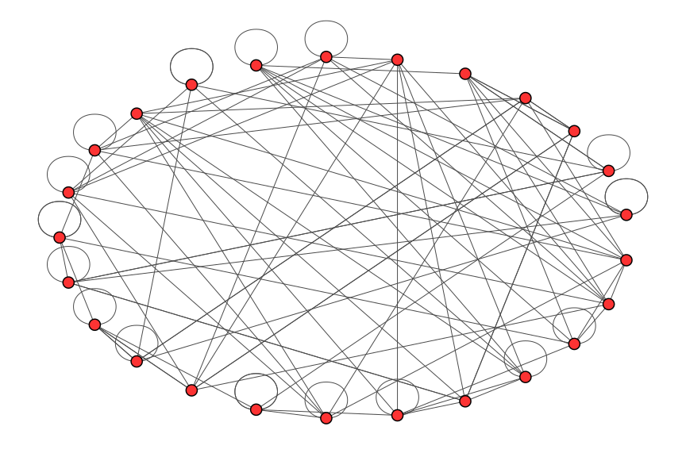

Recent posts:
<ul>
  

    
        
    
    
    <li>
      {{post.date | date_to_string}}  <a class="enum_title" href="{{ post.url }}"><b>{{ post.title }}</b></a>
      {{ post.excerpt }}
       
    </li>

  
</ul>

<figure>
    
    <figcaption>Figure 1: An expander - a most curious sparse graph with strong connectivity properties. Every subset of less than half the total number of vertices has a proportionally large boundary of edges.</figcaption>
</figure>